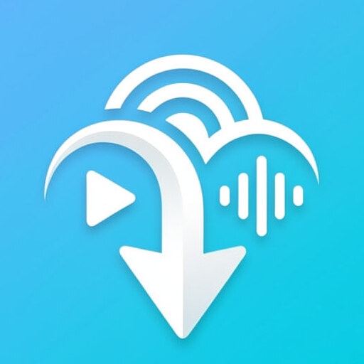

<div align="center">



# Easy Loader

**Скачивай видео, аудио и обложки с YouTube и TikTok — быстро, без лишнего.**

[](https://github.com/komendant-zero/easy-loader-flutter/releases/latest)
[](https://github.com/komendant-zero/easy-loader-flutter/releases)
[](https://flutter.dev)
[](LICENSE)

</div>

---

## Что умеет

- **Видео** — скачивание в выбранном качестве (до 4K), с выбором FPS и кодека (H.264, VP9, AV1)
- **Аудио** — экспорт в MP3/OGG/OPUS с выбором битрейта, кастомными тегами (название, исполнитель)
- **Обложки** — сохранение превью в максимальном разрешении
- **Очередь загрузок** — несколько ссылок одновременно
- **История** — список всего скачанного
- **Темы** — несколько цветовых пресетов, включая режим VHS
- **Уведомления** — оповещения о завершении загрузки
- **Поддержка платформ** — YouTube и TikTok

---

## Установка

### Android

1. Скачай APK из [последнего релиза](https://github.com/komendant-zero/easy-loader-flutter/releases/latest)
2. Разреши установку из неизвестных источников в настройках устройства
3. Установи APK

> Доступны варианты под архитектуры `arm64-v8a`, `armeabi-v7a` и `x86_64`.  
> Для большинства современных телефонов подходит `arm64-v8a`.

### Windows

1. Скачай `EasyLoader-Windows.zip` из [последнего релиза](https://github.com/komendant-zero/easy-loader-flutter/releases/latest)
2. Распакуй в любую папку
3. Запусти `easy_loader.exe`

> Windows Defender может предупредить при первом запуске — это нормально для неподписанных приложений. Жми «Подробнее → Всё равно запустить».

---

## Скриншоты

> *Скриншоты будут добавлены с первым публичным релизом.*

---

## Сборка из исходников

```bash
# Клонировать репозиторий
git clone https://github.com/komendant-zero/easy-loader-flutter.git
cd easy-loader-flutter

# Установить зависимости
flutter pub get

# Android APK
flutter build apk --release --split-per-abi

# Windows
flutter build windows --release
```

**Требования:** Flutter ≥ 3.27, Dart ≥ 3.6, Android SDK (для APK), Visual Studio Build Tools (для Windows).

---

## Стек

| Слой | Технология |
|---|---|
| UI Framework | Flutter 3.27 |
| State Management | flutter_riverpod |
| Загрузка видео | youtube_explode_dart |
| HTTP | dio |
| Медиа конвертация | ffmpeg_kit_flutter_new |
| Шрифты | google_fonts |
| Уведомления | flutter_local_notifications |

---

## Лицензия

[MIT](LICENSE) © 2025 komendant-zero
